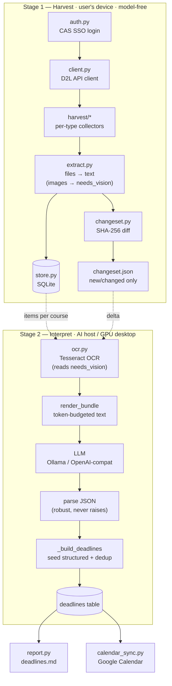
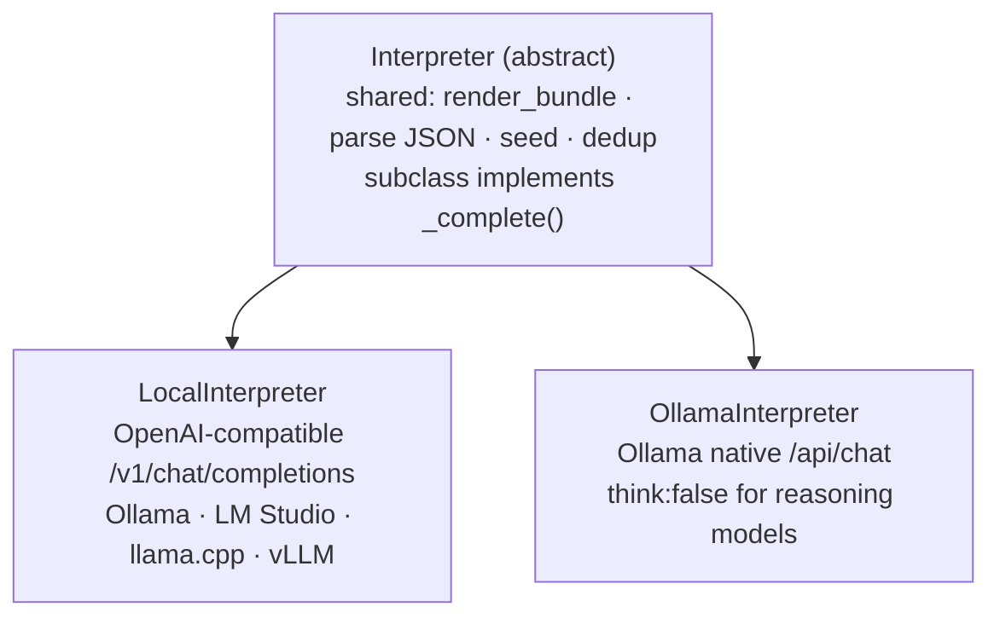
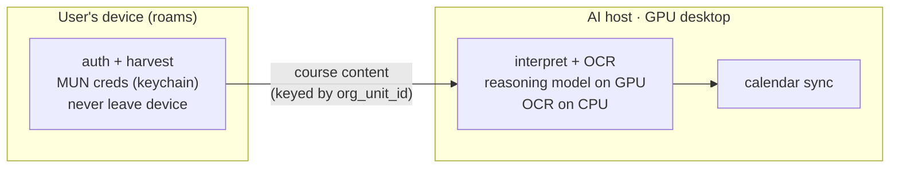

# Architecture

A MUN (Memorial University) Brightspace/D2L scraper that collects course deadlines —
including ones buried in PDFs, syllabi, and announcements with no structured due-date
field — and turns them into a readable report and (optionally) Google Calendar events.

Single-user CLI today, **multi-user-ready** by design (see [DATA_MODEL.md](DATA_MODEL.md)).

---

## The two stages

There is a deliberate **change-detection seam** between harvesting and interpretation, so
the AI only ever sees new or changed content.

---

## Module map

### Stage 1 — Harvest (`cli.py` orchestrates)
| Module | Role |
|--------|------|
| `auth.py` | CAS SSO login at `login.mun.ca` → D2L session cookies. Pure httpx, no browser. |
| `client.py` | Authenticated httpx client; discovers LP/LE API versions; `get_paged` handles bookmark paging. |
| `harvest/courses.py` | Course discovery + scope (`current` / `active` / `all`). |
| `harvest/assignments.py`, `quizzes.py`, `announcements.py`, `calendar.py`, `content.py` | One collector per item type. |
| `extract.py` | Downloaded files → text (PDF/Word/PPT/HTML/txt). **Model-free**: images & scanned PDFs are *not* read here — flagged `needs_vision`, raw file preserved via `content_ref`. |
| `store.py` | SQLite store — the source of truth for what's been seen. |
| `changeset.py` | SHA-256 per item, diff vs the store, emit `changeset.json` of new/changed only. |

### Stage 2 — Interpret (`interpret.py`)
| Module | Role |
|--------|------|
| `ocr.py` | **Interpreter-side** Tesseract OCR. Reads `needs_vision` items from their raw file → text. Runs wherever Stage 2 runs (the GPU desktop); graceful no-op if Tesseract absent. |
| `interpret.py` | Bundles each course's items (structured + unstructured **together**, so the model can reconcile), calls the LLM, seeds structured dates deterministically, dedups → `deadlines` table. |
| `report.py` | Renders `deadlines.md` from the `deadlines` table. |
| `calendar_sync.py` | Pushes deadlines into a dedicated "MUN Deadlines" Google Calendar (pure-httpx OAuth). |

### Shared
| Module | Role |
|--------|------|
| `config.py` | Config from env/`.env` (non-secret only). `load_config(require_credentials=False)` for credential-free entry points. |
| `credentials.py` | MUN credentials in the OS keychain (`keyring`); env fallback. |
| `util.py` | HTML→text, stable item IDs, ISO date parsing. |

---

## LLM backends (Stage 2)

Adding a backend = subclass `Interpreter` and implement `_complete(system, user)`. Bundling,
JSON parsing, structured-date seeding, and dedup are shared in the base class.

| Backend | Endpoint | Notes |
|---------|----------|-------|
| `LocalInterpreter` | OpenAI-compatible `/v1/chat/completions` | Reference backend. |
| `OllamaInterpreter` | Ollama native `/api/chat` | Needed for **reasoning models (Qwen3.x)**: only the native API can set `think:false`. The `/v1` endpoint can't disable thinking, and the model otherwise returns empty content. Select with `LLM_BACKEND=ollama` or `--backend ollama`. |

A cloud backend (Anthropic/OpenAI) slots in the same way.

---

## Key design rules (don't break these)

- **Structured dates are ground truth; the model only adds/reconciles.** `_build_deadlines`
  deterministically *seeds* every assignment/quiz that has a `structured_due_date`, so a
  date the API already knows can never be lost even if the model omits it. Output keeps both
  `structured_due_date` and `final_due_date` + confidence, so changes are auditable.
- **Harvest stays model-free.** No OCR/LLM in Stage 1 — it's deterministic and dependency-light.
  Image work is deferred to the interpreter side (`ocr.py`, and a future vision model).
- **Course-centric, multi-user-ready.** Course-level data is keyed by `org_unit_id` (identical
  for everyone enrolled); per-user data lives in a separate table and is never shared. See
  [DATA_MODEL.md](DATA_MODEL.md).
- **`_parse_model_json` never raises.** A malformed/empty model response degrades to "no model
  deadlines" (seeded structured dates still apply) rather than crashing the run.

---

## Where things run (deployment)

The architecture splits cleanly along the Stage-1/Stage-2 seam:

This is the same shape the eventual multi-user product uses — scrape on the client, AI on a
shared backend, with course-level deadlines pooled per `org_unit_id`.

---

## Storage — where the data lives

Separate **compute** from **storage**. The scraping *compute* is always on the device; where
its *output* is stored depends on the phase.

The act of scraping is inherently device-side: it uses the user's **authenticated MUN
session**, and the security principle is that MUN credentials/session **never leave the
device**. The backend can't do this without holding the user's password — exactly what the
design avoids.

| Stage-1 component | Now (single-user) | Multi-user product |
|-------------------|-------------------|--------------------|
| `auth.py` (CAS login) | device | **device — must be** (MUN session) |
| `client.py` + `harvest/*` (fetch) | device | **device — must be** (uses that session) |
| `extract.py` (files → text, model-free) | device | device (cheap, pairs with fetch) |
| `store.py` / `changeset.py` (persist) | device | device cache **+ upload to backend pool** |

- **Now:** the canonical store is entirely on the user's device — `DATA_DIR/brightspace.sqlite`
  (the full corpus: every item's text + raw payload in `item_json`, deduped by `content_hash`)
  plus `DATA_DIR/content/` (the raw downloaded files referenced by `content_ref`). Nothing is
  stored on the AI host; it only runs the model.
- **Multi-user:** the device still does auth + fetch + extract, then **uploads course-level
  content to the backend pool** (keyed by `org_unit_id`), where Stage 2 interprets it once for
  everyone enrolled. Per-user `enrollment_items` stay private and are never pooled.

**What is retained:** items + raw files accumulate across runs (removed items are kept with
`status='removed'`, not deleted) — a complete archive. **Caveat:** `deadlines` are *replaced*
per course each interpret run (`save_deadlines` delete-then-insert), so the table is the latest
snapshot, not a version history. An audit trail of how a date changed would need an append-only
schema keyed by `run_id`.

## Known limits / gotchas

- **External tools** (Gradescope, Top Hat, Connect) aren't on Brightspace — recorded & flagged, not extracted.
- **Bundle budget:** very large courses can exceed the model's context; oversized output is the case
  chunking (map-reduce) is intended to solve.
- **Re-downloads:** the harvester re-downloads content each run (doesn't yet use `last_modified` to skip).
- No automated test suite — verify with `py_compile`, `interpret --dry-run`, and scoped real runs.
