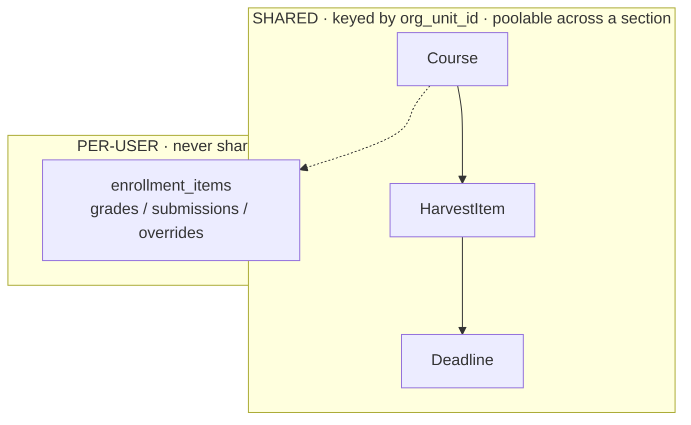
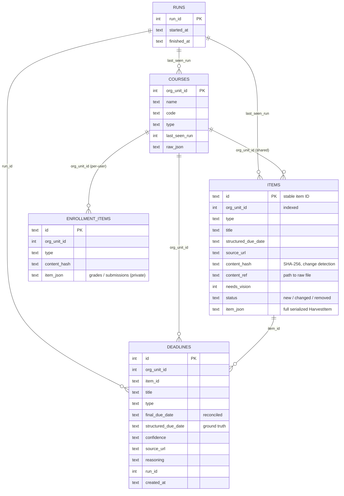
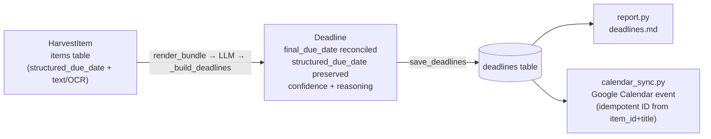

# Data Model

The model is **course-centric and multi-user-ready**. The organizing key is Brightspace's
`org_unit_id` — identical for *everyone* enrolled in the same course offering. That's the seam
a future shared/multi-user backend needs: course-level content is shareable; per-user content
is isolated.



---

## Stable item ID

Every harvested item has a stable, reproducible ID (`util.item_id`):

```
{type}:{org_unit_id}:{item_id}
        e.g.  assignment:671503:6148138
              content_file:671215:6146415
```

Because `org_unit_id` is identical across all enrolled students, this ID is the same for
everyone — so one student's scrape of a course can populate the shared pool for the whole
section. It's also the basis for idempotent Google Calendar event IDs in `calendar_sync.py`.

---

## In-memory types (`models.py`, `interpret.py`)

### `Course` (`models.py`)
| Field | Type | Notes |
|-------|------|-------|
| `org_unit_id` | int | **Primary key.** Identical for all enrolled. |
| `name` | str | e.g. "Mechanisms and Machines" |
| `code` | str \| None | e.g. `ME-4302-001`; the `.YYYYTT` suffix encodes the term |
| `type` | str \| None | e.g. "Course Offering" |
| `raw` | dict | Original API payload |

### `HarvestItem` (`models.py`)
A single harvested artifact — course-level unless `per_user` is True.
| Field | Type | Notes |
|-------|------|-------|
| `id` | str | Stable ID `{type}:{org_unit_id}:{item_id}` |
| `org_unit_id` | int | Owning course |
| `type` | str | One of the item-type constants below |
| `title` | str | |
| `source_url` | str \| None | Link back to the Brightspace item |
| `structured_due_date` | str \| None | ISO-8601 — **authoritative** if Brightspace provided one |
| `body_text` | str \| None | HTML-stripped instructions/body/page text |
| `extracted_text` | str \| None | Text pulled from a downloaded file (or OCR at interpret time) |
| `needs_vision` | bool | Image/scanned file OCR couldn't read → escalate to a vision model |
| `per_user` | bool | If True, lands in `enrollment_items` (private), not `items` |
| `content_ref` | str \| None | Path to the raw downloaded file on disk |
| `raw` | dict | Original API payload |

**Item-type constants:** `assignment`, `quiz`, `announcement`, `calendar_event`,
`content_page`, `content_file`.

### `Deadline` (`interpret.py`)
The Stage-2 output. Keeps *both* dates so any model change is auditable.
| Field | Type | Notes |
|-------|------|-------|
| `org_unit_id` | int | Owning course |
| `item_id` | str \| None | Source item's stable ID (may be null for a model-discovered date) |
| `title` | str | e.g. "Quiz 2", "Mid-Term Exam" |
| `type` | str | assignment / quiz / test / midterm / exam / lab / project / other |
| `final_due_date` | str \| None | The reconciled date the report/calendar uses |
| `structured_due_date` | str \| None | What Brightspace originally said (ground truth) |
| `confidence` | str | high / medium / low |
| `source_url` | str \| None | Link back to the item |
| `reasoning` | str | One line: where the date came from / why |

---

## SQLite schema (`store.py`)

`DATA_DIR/brightspace.sqlite` — five tables. Relationships:



> `save_deadlines` replaces all deadlines for the affected courses with the fresh set each
> interpret run (delete-then-insert per course).

---

## Lifecycle of a deadline



## Why the shared / per-user split matters

Course-level deadlines are **identical for every student in a section** — so a multi-user
backend interprets each course **once** (deduped by `content_hash`) and serves the result to
everyone enrolled. AI work scales with the number of *unique courses*, not the number of
*students*. Per-user data (`enrollment_items`) stays private and is never pooled.
